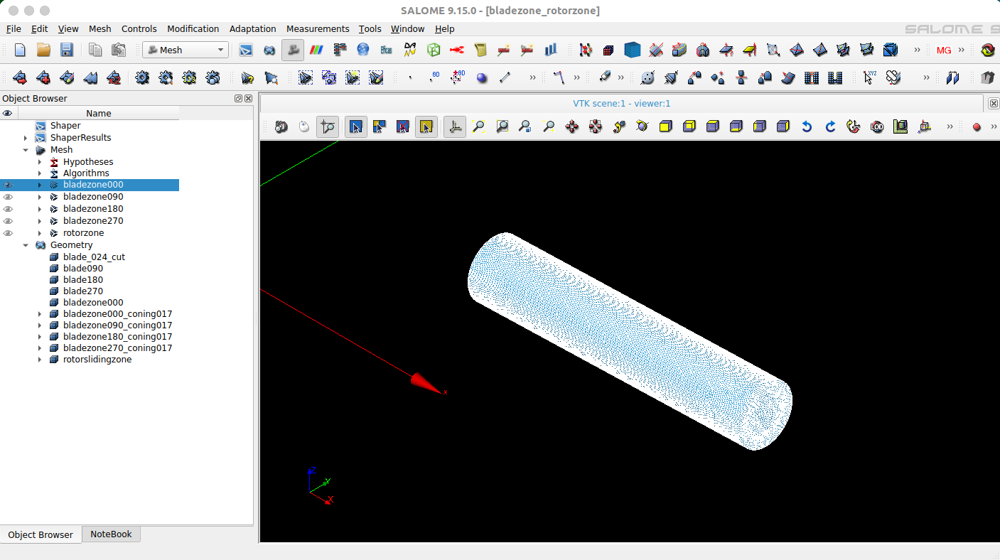
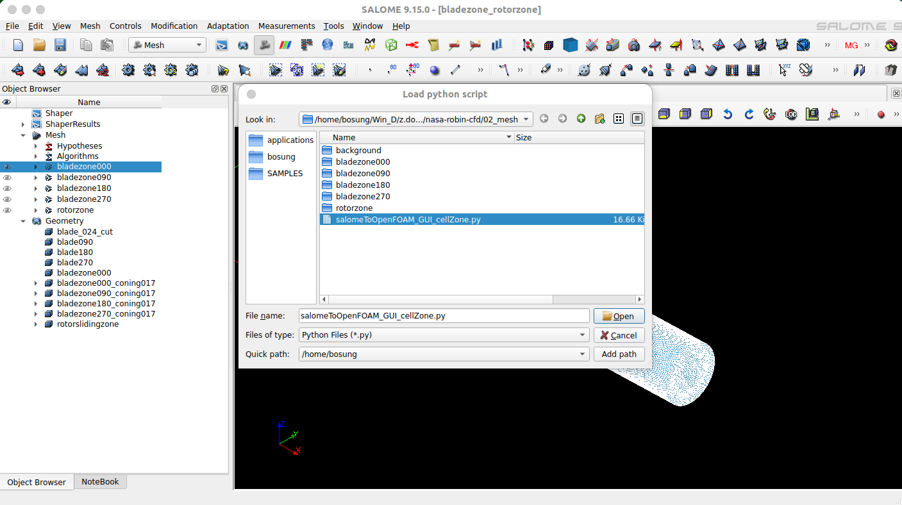
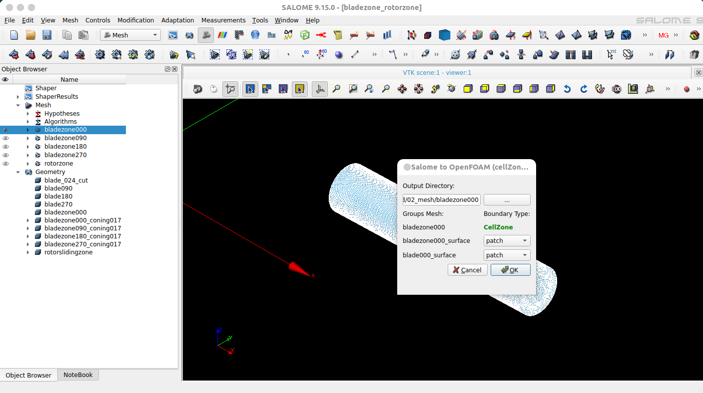
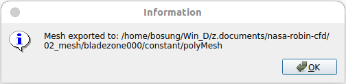
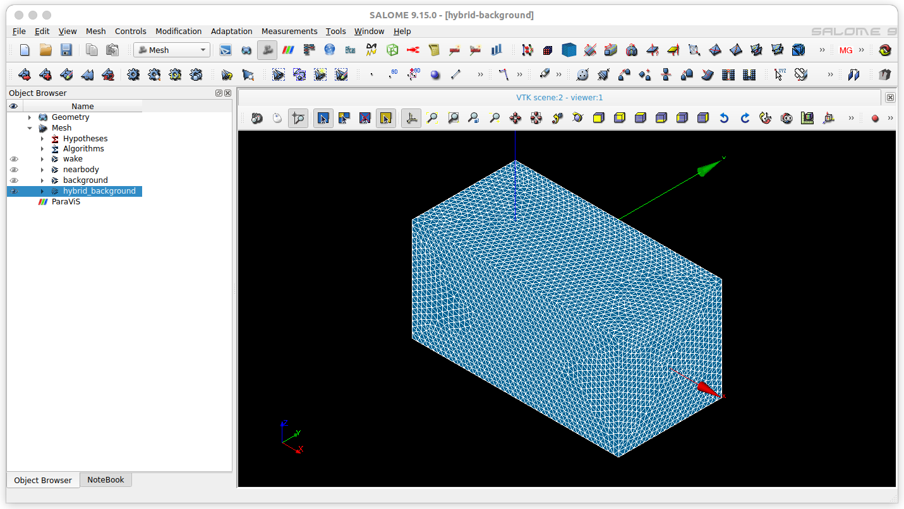
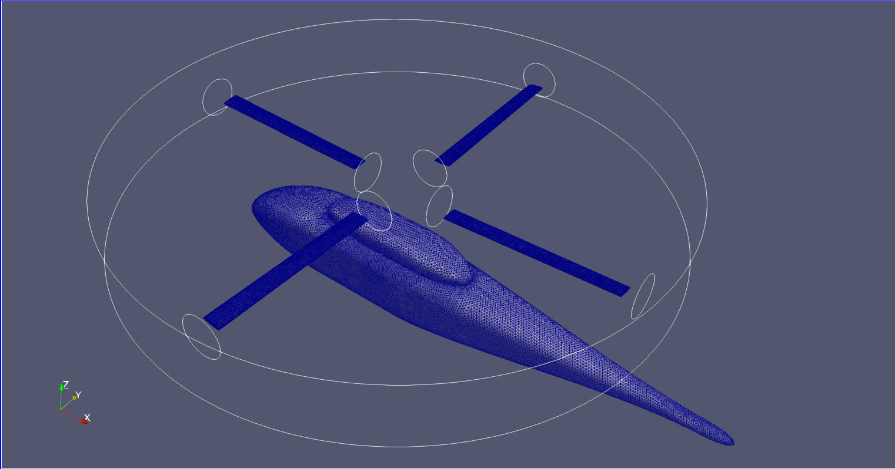

# 02_mesh

This directory contains the meshes for the NASA ROBIN rotor–fuselage CFD simulation. The meshes are generated using SALOME and exported to OpenFOAM format.

---

## Important Note

The original SALOME project files (`*.hdf`) are large (~1.4 GB) and are **not included in this repository**. They can be downloaded from Zenodo:

DOI: https://doi.org/10.5281/zenodo.18955571

After downloading, place the `.hdf` files in this directory.

## Mesh Generation Workflow

### 1. Create case directories for exporting meshes

Copy a simple OpenFOAM tutorial case to create directories for exporting **Salome cellZone meshes**.

```bash
# copy motorBike case for blade at azimuth angle 0
cp -a $FOAM_TUTORIALS/incompressible/simpleFoam/motorBike/ bladezone000

# copy motorBike case for blade at azimuth angle 90
cp -a $FOAM_TUTORIALS/incompressible/simpleFoam/motorBike/ bladezone090

# copy motorBike case for blade at azimuth angle 180
cp -a $FOAM_TUTORIALS/incompressible/simpleFoam/motorBike/ bladezone180

# copy motorBike case for blade at azimuth angle 270
cp -a $FOAM_TUTORIALS/incompressible/simpleFoam/motorBike/ bladezone270

# copy motorBike case for main rotorzone
cp -a $FOAM_TUTORIALS/incompressible/simpleFoam/motorBike/ rotorzone

# copy motorBike case for fuselage and background
cp -a $FOAM_TUTORIALS/incompressible/simpleFoam/motorBike/ background
```

These directories will be used as **target locations for exported meshes** from Salome.


### 2. Export blade meshes using SalomeToOpenFOAM

Export blade meshes using [salomeToOpenFOAM](
https://github.com/bosung-gotocloud/gotocfd/tree/main/salomeToOpenFOAM
)

#### Step 1 — Open the mesh in Salome

Launch **Salome**, open the project file `bladezone_rotorzone.hdf` and switch to the **Mesh** module.



---

#### Step 2 — Load the export script

Select the mesh to export and load the export script.

```
File → Load Script...
```

Choose the script `salomeToOpenFOAM_GUI_cellZone.py`

Then click **Open**.



---

#### Step 3 — Specify output directory

Set the **Output Directory** to `bladezone000`.

This directory corresponds to the blade mesh at azimuth angle 0°.

Then click **OK**.



---

#### Step 4 — Verify export

If the export is successful, the following window will appear.



Repeat the same procedure for the following meshes:

- bladezone090  
- bladezone180  
- bladezone270  
- rotorzone  

---

### 3. Export fuselage and background mesh

Open the Salome project file: `hybrid-background.hdf`

Export the mesh to the directory: `background`



### 4. Merge all meshes into a single OpenFOAM mesh

First copy the background mesh to create the **main mesh directory**.

```bash
cp -a background robinmesh
```

Then merge the blade and rotor meshes into `robinmesh`.

```bash
mergeMeshes robinmesh/ bladezone000/ -overwrite
mergeMeshes robinmesh/ bladezone090/ -overwrite
mergeMeshes robinmesh/ bladezone180/ -overwrite
mergeMeshes robinmesh/ bladezone270/ -overwrite
mergeMeshes robinmesh/ rotorzone/ -overwrite
```

After merging, the combined mesh is stored in `robinmesh/constant/polyMesh`

Under the `polyMesh` directory, OpenFOAM mesh files are created:

```
boundary
cellZones
faceZones
faces
neighbour
owner
pointZones
points
```

---

### 5. Verify merged boundary patches

Check the merged boundary patches.

```bash
cat robinmesh/constant/polyMesh/boundary
```

A total of **16 boundary patches** are successfully merged.

Example:

```
16
(
    rotorzone_surface_slave
    robin_surface
    far_surface
    bladezone000_surface
    blade000_surface
    bladezone090_surface
    blade090_surface
    bladezone180_surface
    blade180_surface
    bladezone270_surface
    blade270_surface
    bladezone000_surface_slave
    bladezone090_surface_slave
    bladezone180_surface_slave
    bladezone270_surface_slave
    rotorzone_surface
)
```

### 6. Check mesh quality

Finally, verify the mesh quality using `checkMesh`.

```bash
cd robinmesh
checkMesh
```
Ensure all quality metrics (cell volume, face area, skewness, non-orthogonality, and boundary openness) pass.

Example output:

```
Mesh OK.
```

The mesh passes all major quality checks, including:

- cell volume  
- face area  
- skewness  
- non-orthogonality  
- boundary openness  



## Next Steps

After verifying the mesh, copy `polyMesh` into the simulation case:
```
cp -r robinmesh/constant/polyMesh ../../03_case/case/constant/
```

Follow the simulation instructions in `03_case/README.md`.