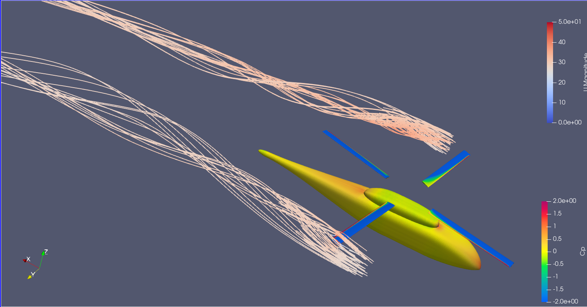

# 04_post

This directory contains **post-processing data and visualization files** used to analyze the CFD results of the **NASA ROBIN rotor simulation**.

The files include:

- experimental reference data
- processed CFD results
- ParaView state files for visualization

---

# Directory Contents

```
04_post/
├─ Exp_Table21_Table22.xlsx
├─ centerline_cp.xlsx
├─ unsteady_pressure.xlsx
├─ centerline.pvsm
├─ streamline.pvsm
├─ vortex-core.pvsm
├─ vorticity.pvsm
└─ q.pvsm
```

---

# 1. Experimental Reference Data

### `Exp_Table21_Table22.xlsx`

This file contains **experimental pressure data** extracted from:

> Mineck, R. E., and Gorton, S. A.,  
> *Steady and Periodic Pressure Measurements on a Generic Helicopter Fuselage Model in the Presence of a Rotor*,  
> NASA/TM-2000-210286, 2000.

Specifically, the file includes the data from:

- **Table 21**
- **Table 22**

These experimental measurements are used as the **reference data for validation of the CFD simulation**.

---

# 2. Processed CFD Results

### `centerline_cp.xlsx`

This file contains the **pressure coefficient (Cp)** distribution along the **centerline of the ROBIN fuselage** obtained from the CFD simulation.

The data is extracted from the CFD solution and used for comparison with experimental measurements.

---

### `unsteady_pressure.xlsx`

This file contains **unsteady pressure data at probe locations**.

The values correspond to the **10th rotor revolution** of the simulation.

During the simulation, probe data are written to:

```
case/postProcessing
```

The data from the **10th revolution** are extracted and organized in this Excel file for analysis and comparison.

---

# 3. ParaView Visualization Files

The `.pvsm` files are **ParaView state files** used for visualization of the CFD results.

These files store:

- visualization pipeline
- color maps
- filters
- camera settings

Available state files:

| File | Description |
|-----|-------------|
| `centerline.pvsm` | Visualization of fuselage centerline Cp distribution |
| `streamline.pvsm` | Flow streamlines around the rotor and fuselage |
| `vortex-core.pvsm` | Rotor vortex core visualization |
| `vorticity.pvsm` | Vorticity field visualization |
| `q.pvsm` | Q-criterion vortex visualization |
---



# 4. Using the ParaView State Files

After the CFD simulation is completed, the state files can be used to reproduce the visualization.

Steps:

1. Launch **ParaView**

2. Open one of the `.pvsm` files

3. When prompted, select the simulation case directory

Example:

```
03_case/case
```

ParaView will automatically load the required simulation data and apply the visualization pipeline defined in the state file.

---

# Notes

- The Excel files contain **processed data used for validation and analysis**.
- The `.pvsm` files allow **reproducible visualization of the CFD results** using ParaView.
- These files correspond to the results presented in the associated research work.
